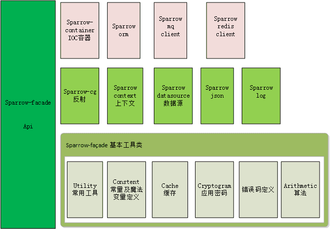

麻雀虽小，但五脏俱全
---
这个框架我从11年开始写，中间重构了n遍，最原始的代码可能都找不到了，之所以坚持写，不是想新造轮子。
主要是从中学习基础原理。
经过近十年的打磨，有些设计思想和理念，是值得学习的,比如spring mvc 的设计模式，orm ico 等等。
虽然很多朋友们都了解，但要真正自己实现起来也并不是那么容易。而这个过程对原来的深入理解是很帮助，所以将这部分开源出来，供有同样需求的朋友参考，大家一起进步，成长。

框架特点
---
- 相信程序员

通过对原理有了更深入的了解，对写程序来讲会更简单，高效，很多框架之所以很重，很重要的一个原因是不相信程序员，这个框架从jdk出发，尽量不依赖第三方jar 包，让程序能跑起来，让程序更快。

- 从0开始

0依赖，框架实现最简单的，最核心的功能，尽量不依赖任何框架，包括spring。

- 解耦
 
sparrow-facade 只定义了一些接口，具体实现在其他的jar包中，业务可以选择依赖，或不依赖，只实现了部分核心工具类。

- 扩展
 
遵循开闭原则，对业务提供扩展点。

项目架构及远期规划
---
架构中大部分功能已具基本的使用框架，但还需要进一步完善和优化，具体内容可查看架构详细介绍

jedis和rocket mq 客户端已具备基本的生产环境使用条件

其它模块还需进一步完善，欢迎有兴趣的小伙伴，一起加入
email:zh_harry#163.com

[架构详细介绍 https://www.jianshu.com/p/74122495a463](https://www.jianshu.com/p/74122495a463)

start
-----
[测试用例 https://github.com/sparrowzoo/sparrow-test](https://github.com/sparrowzoo/sparrow-test)
sparrow-test 为case 逐步完善中...

